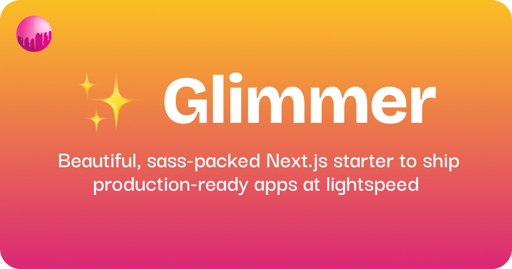

# ✨ Glimmer

Next 15 starter with i18n, Testing, React Query, and more • Bring your own UI framework • from the [sassywares](https://sassywares.com) team.

Compatible with Next.js 15.0.0+ and React 19.0.0+

## Table of Contents

- [Features](#features)
- [Getting Started](#getting-started)
  - [i18n](#i18n)
  - [Project structure](#project-structure)
    - [App Directory](#app-directory)
    - [Modules](#modules)
    - [Config](#config)
    - [Routes](#routes)
    - [Storage](#storage)
    - [Services](#services)
      - [React Query](#react-query)
      - [Server Components](#server-components)
      - [Axios](#axios)
  - [Testing](#testing)
    - [Unit tests](#unit-tests)
    - [E2E tests](#e2e-tests)
  - [Everyday hooks](#everyday-hooks)
- [Philosophy](#philosophy)
- [Roadmap](#roadmap)

## Features

- i18n 🌐 with Next-Intl
- Project structure 📂 with DDD
- Testing 🧪 with Jest and Cypress
- Services 📦 with Axios, React Query, and a CRUD starter
- Everyday hooks 🔥 (useMediaQuery, useLocalStorage, etc)
- Just about everything else you need to ship a production-ready app

## Getting started

Clone the repo or use it as a template to create your own. Then, follow the instructions below to get started.

Install the dependencies:

```bash
pnpm install
```

Start the development server:

```bash
pnpm dev
```

Build the app:

```bash
pnpm build
```

Start the production server:

```bash
pnpm start
```

Run unit tests:

```bash
pnpm test
```

Watch unit tests:

```bash
pnpm test.watch
```

Run E2E tests:

```bash
pnpm e2e
```

Watch E2E tests:

```bash
pnpm e2e.watch
```

## i18n

Glimmer comes pre-configured with [Next-Intl](https://next-intl-docs.vercel.app/docs/introduction) for internationalization. You can see that;

1. The `next.config.ts` file is configured to use the `i18n.ts` file as the source of truth for the app's locales.
2. The `messages` directory contains the app's locale files.
3. The `middleware.ts` file is configured to use next-intl's middleware.
4. The `src/i18n` directory to configure everything related to internationalization.

- `config.ts` exports the i18n configuration.
- `request.ts` contains internal helpers for next-intl.
- `routing.ts` exports wrappers around Next.js' navigation APIs that will consider the routing configuration. An eslint rule has also been added to ensure all navigation is done through the wrappers. Meaning you should never use `next/link` or `next/navigation` directly, and instead use the `Link` and `redirect` wrappers from `src/i18n/routing.ts`.

4. A `[locale]` route segment is added to the `app` directory. This is Next.js' recommended way to handle i18n. Next-intl uses this under the hood and it's what allows us to have a locale in the URL without interfering with the routing configuration.

With the setup above, your app now supports i18n out of the box. If you wanna learn more about how I've configured it, you can read the [i18n](./docs/i18n.md) docs.

## Project structure

I love the DDD (Domain-Driven Design) architecture, and after years of working with React, I've come to realize that DDD is, most likely, the only way to build a scalable, modular frontend.

If you're not familiar with DDD, you can learn more about it [here](https://en.wikipedia.org/wiki/Domain-driven_design).

### App Directory

Next.js' app directory can be used to contain your whole app, but I don't recommend it. Reason why being that you're locking yourself into a vendor and porting your app to another React framework, or just React, will be a pain in the ass.

Hence, I recommend using the app directory as the router, it has very strong support for error boundaries and loading states, so let's keep it that way and build the app around it instead of inside it.

### Modules

The `modules` directory contains the app's top-most modules. This can be a user, a product, an order, etc, depending on the app.

One thing to keep in mind is that top-level modules should be the very core of what the app does, such that just by looking at the modules directory, you understand what the app does. Here's an example:

```
src/modules/
  add-money
  send-money
  transactions
  recipients
```

What does this tell you about the app? That it's a money transfer app, right? I hope so 😃
But, what about the other modules? Payment methods, notifications, settings, etc.

That's exactly what I use the `shared` module for. Inside `modules/shared`, you'll notice that I have a token module. Token is, usually, not a core module, but it's used by the other modules, so it makes sense to have it inside the `shared` module.

With that out of the way, let's talk about the structure of a module. But, before we do that, let's look at the files inside the `src` directory.

Apart from `app`, `i18n`, `modules`, and `middleware`, you'll notice a bunch of other files. Let's talk about them.

This is what I call the root module, `src` itself. All your globally shared logic, your hooks, utils, types, components, etc, go here.

You can keep your dumb UI components here, your utility hooks here, your context providers here, etc. But what should you keep inside a module, then?

Anything the module needs to function properly. Compoents, hooks, utilities, context providers, services, types, whatever it needs. One thing I like to do is to prefix these files with the module name, such as `user.utils.ts`, `user.service.ts`, makes it easier to identify as you scale.

As for the components, a module's components should be module-specific, such as `user-avatar`, which can use an `avatar` component from the root components directory, you get the idea.

This way, your app is infinitely scalable, and you can add as many modules as you want. And your pages can simply use the components from these modules.

### Config

Have you noticed the `src/config.ts` file? This is where you can keep your app's configuration, which can be coming from the environment, or another config file, etc.

This config file exports 2 things:

1. A `config` object, which contains the app's configuration.
2. A `getConfig` function, which can be used to get the value of an environment variable.

The `config` object merges all module configs with the root config, allowing you to have module-specific configuration, while also providing a root config for the app from the same source of truth.

For example, say you have a `user` module, and it has a file named `user.config.ts`, inside which you have something like this:

```ts
export const userConfig = {
  enableNotifications:
    getConfig("NEXT_PUBLIC_ENABLE_NOTIFICATIONS", "true") === "true",
};
```

Now, in your root config, you can have something like this:

```ts
export const config = {
  user: userConfig,
};
```

This way, you can have module-specific configuration, while also having a root config for the app from the same source of truth.

I am working on a feature flag service that will enhance this even more, allowing you to have feature flag-based configuration for your app, but that's for another time.

### Routes

The `routes.ts` file is where you can keep your app's routing configuration. Since we have file-based routing, it's not ideal to manually insert strings whenever we need to navigate to a new route.

Just like config, modules can have their own routes, and they will be merged with the root routes to form the complete routing configuration for the app.

For example, say you have a `user` module, and it has a file named `user.routes.ts`, inside which you have something like this:

```ts
export const userRoutes = {
  profile: "/user/profile",
};
```

Now, in your root routes, you can have something like this:

```ts
export const routes = {
  user: userRoutes,
};
```

This way, you can have module-specific routes, while also having a root routes for the app from the same source of truth.

### Storage

Storage in the browser is always a pain, and I've seen many apps just use the `localStorage` API directly, which is not a good idea, what if you wanna use a different storage solution down the line?

The `src/storage.ts` file exports a `Storage` class, which is a wrapper around the `localStorage` API, and it also allows you to easily switch to a different storage solution down the line.

Say you have a `user` module, and it needs to store some user-related data, you can do something like this:

```ts
const userStorage = new Storage("user");
```

And then use the different methods exposed by the `Storage` class to store, retrieve, and invalidate data:

```ts
userStorage.set("1234567890");
userStorage.setSerialized({ token: "1234567890" });

userStorage.get();
userStorage.getDeserialized();

userStorage.invalidate();
```

Do explore the `Storage` class to see all the different methods it exposes. At the end of the day, you own this code so you can always add more methods to it.

### Services

Services are a way to abstract away your data layer or your data fetching logic. The consumer, which can be a React component, a hook, a Next.js route handler, etc, doesn't need to know how the data is being fetched, they just need the data. This also allows you to easily switch between different data fetching strategies, such as REST, GraphQL, etc, down the line.

There is a `src/service.ts` file that exports a `Service` class with the very basic requirements (which is what most apps require btw) in the form of a CRUD service.

Say you have a `user` module, and it needs to fetch users from the API, you can create a file named `user.service.ts` inside the `modules/user` directory and do something like this:

```ts
const userService = new Service<User>(config.user.serviceUrl, "users");
```

And then use it to fetch, create, update, and delete users:

```ts
const users = await userService.get();
const user = await userService.create({ name: "John Doe" });
const updatedUser = await userService.update(user.id, { name: "Jane Doe" });
const deletedUser = await userService.delete(user.id);
```

Keep in mind that this is all JavaScript, so you can use it anywhere you want, not just in React. Just by doing that, you've abstracted away the data fetching logic from the consumer, and can now focus on what's important rather than reinventing the wheel.

This setup also means that you can use it with microservices without an ounce of a problem. Say you have a user service hosted somewhere, your `userService` instance can be used to interact directly with the hosted instance.

But, how do we use this service in a React component, you ask?

#### React Query

The two arguments passed to the `Service` class constructor are the service URL and the endpoint. The endpoint is the part that comes after the base URL. The service then uses both of these to generate a key for the class.

Meaning, using it with React Query is as easy as this:

```ts
const { data, isLoading, isError, error } = useQuery({
  queryKey: [userService.key, { id }],
  queryFn: () => userService.getById(id),
});
```

And for mutations, you can do something like this:

```ts
const createUser = useMutation({
  mutationFn: (user: User) => userService.create(user),
});
```

You can visit `/rq/users` in your browser with the dev server running to see React Query with the `userService` in action, and then you can open [users/page.tsx](./src/app/[locale]/rq/users/page.tsx) to see how it's working under the hood.

#### Server Components

I don't know when will Server Components become stable, but they're a pretty sick feature. Since our services are just javascript, we can use them in server components directly.

```tsx
export async function UserList() {
  const users = await userService.get();

  return (
    <div>
      {users.map((user) => (
        <div key={user.id}>{user.name}</div>
      ))}
    </div>
  );
}
```

You can visit `/rsc/users` in your browser with the dev server running to see server components with the `userService` in action, and then you can open [users/page.tsx](./src/app/[locale]/rsc/users/page.tsx) to see how it's working under the hood.

#### Axios

One thing we completely stepped over is how is the Service using Axios under the hood? Let's go to `src/api.ts`:

```ts
export function withAccessToken(...) { ... }
export function with401Redirect(...) { ... }

export function createApi(...) { ... };
export function useApiErrorMessage(...) { ... };
```

All these are just utility functions that make working with Axios a breeze.

- `withAccessToken` is used to add the access token to the request headers, you can update the logic as per your use case.
- `with401Redirect` is used to redirect the user to the sign-in page if they are not authenticated, again, you can do whatever you want here.
- `createApi` is used to create an Axios instance with the base URL and interceptors listed above.
- `useApiErrorMessage` is used to get an error message from an unknown error, which then fallbacks to your default error message.

Now, let's go back to `src/service.ts`. Notice that the class has an internal member named `api`, and it uses the `createApi` method inside the constructor to create it.

This lets each service have its own axios instance, and you can use it to make requests to the API using the class methods. Sick, right? And the best part? You can modify anything you want, however you want, however you need.

### Testing

I know the industry is really skeptical and weird about testing, but it's really simple, it's just the way its handled is what makes it difficult to even take seriously.

Managers shoving coverage down your throat, forcing you to write tests for the sake of writing tests instead of actually producing a well-tested specimen, all while the industry "gurus" are telling you on LinkedIn that you're bad if you don't write tests — I get it, it's hard, and I'm here to help.

#### Unit tests

Unit testing is simple, really really simple. I have Jest configured for you, everything existing in Glimmer is already tested, everything you write, everything that is of value, you should write tests for.

There are 3 key components of unit testing:

1. The subject, can be the React Component, the hook, the service, whatever.
2. The dependencies, all of which you mock, after all unit testing is all about testing in isolation, so you mock every little detail and then test just the subject.
3. The test itself.

I'm not going to guide you on how to write tests, instead I'm going to show you how I like to structure them.

Say you have a hook named `use-verify-email.ts` inside the hooks directory of your `user` module, I'd prefer to create a `__tests__` directory right next to `use-verify-email.ts`, named as `use-verify-email.test.ts`, this way your source and its test stay together but are also separated enough.

I'll create a separate guide on how to write tests, because that's not what Glimmer is about.

#### E2E tests

Notice that there is no mention of integration tests, that's because I truly hate them. I hate how complex they become and how many dependencies you have to mock. Integration tests are awesome in all contexts, mostly, except for frontend. It's just not worth it.

E2E tests, on the other hand, are simple. You move like a true user, interacting with the app like a user would, testing everything along the way, dealing with user stories and whatnot.

Glimmer has a very baseline configuration for Cypress, and it can be groomed a lot, but then again, you have full control of how you want to handle things.

### Everyday hooks

I've added all the hooks I use from different libraries into Glimmer without the libraries, you can find them inside `src/hooks`, and add more as you go.

A few notable examples are:

- [useCopyToClipboard](./src/hooks/use-copy-to-clipboard.ts)
- [useIntersectionObserver](./src/hooks/use-intersection-observer.ts)
- [useMediaQuery](./src/hooks/use-media-query.ts)

There are a lot more, do checkout the directory to see the full list.

## Philosophy

The reason why I made Glimmer was because I would reinvent the wheel everytime I would build an app. Always doing the same things, over and over again, and Glimmer is just a way to abstract 90% of that.

Glimmer is designed to be a bare-bones abstraction to subtract all the effort that goes into setting up an app, and focus on the coding and shipping part. How well does it do in that regard? Please let me know.

I don't want to bloat Glimmer with things that change between projects, such as a UI framework, a markdown parser, a state management library, etc, you can add all that in your clone of it, then again I will ship an extended version with all that as per my own needs.

## Roadmap

- [ ] Add more hooks 🔥
- [ ] Add versioning to the project 🔖
- [ ] Add contribution and merge request guidelines 🤝
- [ ] Add a guide on how to write tests 🧪
- [ ] Add precommit hooks to format and lint the code 🧼
- [ ] Add husky to run tests on commit 🐶
- [ ] Add a feature flag service 🏳️
- [ ] Ship an extended version with much more juice 🥤
- [ ] Ship a leaner version for monorepos 📦
- [ ] Add a CI/CD pipeline for deployments 🤖
- [ ] Add deployment instructions 📝
- [ ] Add containerization support for easy deployment 🐳

You made it to the end? Mad props 🤘

If you have any ideas or suggestions, please let me know. This is an open-source project and all contributions are welcome. You can reach out to me on [LinkedIn](https://www.linkedin.com/in/kayshawn/) or my [email](mailto:kay@sassywares.com).
